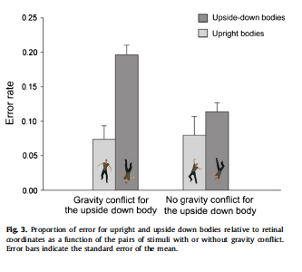
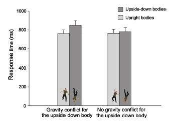

#### Article ID: COGGV
#### Pilot: Cinoo Lee
#### Co-pilot: Tom Hardwicke
#### Start date: Mar 17 2017
#### End date: Nov 17 2017
#### Final verification: Tom Hardwicke
#### Date: Nov 17 2017

-------

#### Methods summary: 
Participants were seated in front of the computer screen in the dark and were asked to determine whether the two body positions presented were the same or different (e.g. an arm or a leg of the figure could be in a different angle or in a different position). Half of the time, the person in the picture was in an upright position and half of the time, it was in an inverted position. For each trial, the first stimulus was on the screen for 250 ms, then came a blank screen for 1000ms, and then the second stimulus was presented till participants responded with either the "E" key(i.e. same stimulus) or the "O" key(i.e. different stimulus). Response time and accuracy of the response were recorded.

------

#### Target outcomes: 

Focus is on the findings reported in section 3.1. Across participants accuracy. Specifically, we will attempt to reproduce all descriptive and inferential analyses reported in the text below and associated tables/figures:

> Analysis of error rates (Fig. 3) revealed that the inversion effect was strongly reduced when there was no conflict between visual and actual gravity compared to the conditions were there was a conflict of gravity (t(21) = 2.72; p < 0.02; partial eta2 = 0.26).

> The inversion effects were decomposed with Student’s t-test. Analysis revealed that in the conditions with upside down bodies, participants made more errors when gravity orientation was also inverted (gravity conflict, Fig. 1b) than when visual gravity was upright (Fig. 1d) (t(21) = 3.87; p < 0.001; partial eta2 = 0.42). In contrast, we found no differences between the conditions with upright bodies (Fig. 1a and c) (t(21) = 0.35; p = 0.73; partial eta2 = 0.006).

> The inversion effect was also computed on RT for conditions with gravity conflict (conditions b–a in Fig. 1) and conditions without gravity conflict (conditions d–c in Fig. 1). The normality of data distributions was tested using Kolmogorov-Smirnov test. No distributions differed from normality (all p > 0.05). The inversion effects were compared using Student’s t-tests. The threshold of statistical significance was set at 0.05.

> The reaction time results (Fig. 4) revealed that the inversion effect was also strongly reduced in the condition in which there was no gravity conflict compared to the conditions in which there was a gravity conflict (t(21) = 2.87; p < 0.001; partial eta2 = 0.28). Analysis revealed that in conditions with upside down bodies relative to retinal coordinates, participants were slower when gravity orientation was also inverted (gravity conflict, Fig. 1b) than when visual gravity was upright relative to retinal coordinates (Fig. 1d) (t(21) = 4.10; p < 0.001; partial eta2 = 0.45). In contrast, we found no differences between the conditions with upright bodies (Fig. 1a and c) (t(21) = 0.13; p = 0.89; partial eta2 = 0.001)."

Additional data analysis notes:

> For RT data, we analyzed only trials that corresponded to a correct response: 7468 ± 506 trials over 8448 (88.4%). When reaction time was slower than 200 ms or when it deviated from the mean by more or by less than 3 standard deviations, the trial was excluded (0.5% of the data).

> The inversion effect was calculated by the subtraction of the error rate measured in upright orientation from the error rate in inverted orientation (180) for each pair. This was calculated for conditions with gravity conflict (b-a conditions in Fig. 1) and conditions without gravity conflict (d-c conditions in Fig. 1). The inversion effects were compared using Student’s t-test. The threshold of statistical significance was set at 0.05. When needed, a Bon- ferroni correction for multiple comparisons was used. In this case, the corrected threshold of statistical significance was a = 0.025 (0.05/2).

------

```{r global_options, include=FALSE}
knitr::opts_chunk$set(echo=TRUE, warning=FALSE, message=FALSE)

# prepare an empty report object, we will update this each time we run compareValues2()
reportObject <- data.frame("Article_ID" = NA, "valuesChecked" = 0, "eyeballs" = 0, "Total_df" = 0, "Total_p" = 0, "Total_mean" = 0, "Total_sd" = 0, "Total_se" = 0, "Total_ci" = 0, "Total_bf" = 0, "Total_t" = 0, "Total_F" = 0, "Total_es" = 0, "Total_median" = 0, "Total_irr" = 0, "Total_r" = 0, "Total_z" = 0, "Total_coeff" = 0, "Total_n" = 0, "Total_x2" = 0, "Total_other" = 0, "Insufficient_Information_Errors" = 0, "Decision_Errors" = 0, "Major_Numerical_Errors" = 0, "Minor_Numerical_Errors" = 0, "Major_df" = 0, "Major_p" = 0, "Major_mean" = 0, "Major_sd" = 0, "Major_se" = 0, "Major_ci" = 0, "Major_bf" = 0, "Major_t" = 0, "Major_F" = 0, "Major_es" = 0, "Major_median" = 0, "Major_irr" = 0, "Major_r" = 0, "Major_z" = 0, "Major_coeff" = 0, "Major_n" = 0, "Major_x2" = 0, "Major_other" = 0, "affectsConclusion" = NA, "error_typo" = 0, "error_specification" = 0, "error_analysis" = 0, "error_data" = 0, "error_unidentified" = 0, "Author_Assistance" = NA, "resolved_typo" = 0, "resolved_specification" = 0, "resolved_analysis" = 0, "resolved_data" = 0, "correctionSuggested" = NA, "correctionPublished" = NA)
```

## Step 1: Load packages

```{r}
library(tidyverse) # for data munging
library(knitr) # for kable table formating
library(haven) # import and export 'SPSS', 'Stata' and 'SAS' Files
library(readxl) # import excel files
library(pipeR) # code organisation
library(CODreports) # custom report functions
# custom functions
sem <- function(x) {sd(x) / sqrt(length(x))}
ci95.norm <- function(x) {
  me <- sem(x)*qnorm(.975)
  c(mean(x)-me, mean(x)+me)
}
etaSquared <- function(t, df) { # custom function calculates eta squared from t-value and df
  return(t^2/(t^2 + df))
}
```

## Step 2: Load data

```{r}
expdata <- read_excel("data/data.xlsx", sheet = 2)
summary(expdata)

expdata <- expdata %>%
  rename(id = Subject_nb)

names(expdata) <- gsub(" ", "_", names(expdata))
```

## Step 3: Tidy data

```{r}
expdata_tidy <- select(expdata, id, starts_with("B"))
expdata_tidy <- expdata_tidy %>%
  rename(BUGD = BU_GD,
         BDGU = BD_GU,
         BUGU = BU_GU,
         BDGD = BD_GD,
         BUGD_ms = `BU_GD_(ms)`,
         BDGU_ms = `BD_GU_(ms)`,
         BUGU_ms = `BU_GU_(ms)`,
         BDGD_ms = `BD_GD_(ms)`)

expdata_accuracy <- expdata_tidy %>%
  select(id, BUGD, BDGU, BUGU, BDGD) %>%
  gather(position, accuracy, BUGD, BDGU, BUGU, BDGD)

expdata_accuracy <- expdata_accuracy %>%
  mutate(body = substr(expdata_accuracy$position,2,2)) %>%
  mutate(gravity = substr(expdata_accuracy$position,4,4)) %>%
  select(id, body, gravity, accuracy)
         
expdata_rt <- expdata_tidy %>%
  select(BUGD_ms, BDGU_ms, BUGU_ms, BDGD_ms) %>%
  rename(BUGD = BUGD_ms,
         BDGU = BDGU_ms,          
         BUGU = BUGU_ms,
         BDGD = BDGD_ms) %>%
  gather(rtposition, rt, BUGD, BDGU, BUGU, BDGD)
  
expdata_rt <- expdata_rt %>%
  mutate(body = substr(expdata_rt$rtposition,2,2)) %>%
  mutate(gravity = substr(expdata_rt$rtposition,4,4)) %>%
  select(rt)

expdata_tidy <- bind_cols(expdata_accuracy, expdata_rt) %>%
  select(id, body, gravity, accuracy, rt) %>%  
  mutate(subid = substr(id,2,4),
       body = factor(body),
       gravity = factor(gravity)) %>%
  select(subid, body, gravity, accuracy, rt) %>%
  rename(id = subid)
```

## Step 4: Run analysis

### Pre-processing

> For RT data, we analyzed only trials that corresponded to a correct response: 7468 ± 506 trials over 8448 (88.4%). When reaction time was slower than 200 ms or when it deviated from the mean by more or by less than 3 standard deviations, the trial was excluded (0.5% of the data).

(We assume that the authors meant 'faster than' rather than 'slower than' because 'slower than' leads to the majority of the data being excluded.) NB - author confirms that was written incorrectly in the paper.

Note also that it is unclear exactly when the standard deviation cut offs were calculated - was it before or after selecting only the correct responses? And were they calculated before or after implementing the 200ms cut off? Additionally the denomiator for the number of trials does not appear to be the total number of trials (16896) but rather half this number, presumably some combination of conditions. We asked the author to clarify this information, but they did not address these particular issues. We are therefore uncertain if these exclusion criteria have been implemented as they were in the original study. We consider this an insufficient information error.

```{r}
# first select only accurate responses
rt_tidy <- expdata_tidy %>%
  filter(accuracy == 1) 

# not set sd thresholds
sd_threshold_lower <- mean(rt_tidy$rt)-(sd(rt_tidy$rt)*3)
sd_threshold_upper <- mean(rt_tidy$rt)+(sd(rt_tidy$rt)*3)

# now impose the >= 200 ms and sd threshold filters
rt_tidy <- rt_tidy %>%
  filter(rt >= 200 & rt > sd_threshold_lower & rt < sd_threshold_upper) %>%
  select(id, body, gravity, rt)

nrow(rt_tidy)/16896
```

This is not quite the 88.4% suggested in the article - it is unclear if we are implmenting the exlcusion criteria as done originally.

```{r}
error_tidy <- expdata_tidy %>%
  select(id, body, gravity, accuracy)
```

### Descriptive statistics



Calculate error rate at participant level and then group level summary statistics.

```{r}
sumdat <- error_tidy %>>% 
  group_by(body, gravity, id) %>>% 
  summarise(errorRate = mean(1-accuracy)) %>>%
  (~ error_tidy_plevel) %>>%
  group_by(body, gravity) %>>%
  summarise(m = mean(errorRate), se = sem(errorRate))

sumdat %>% kable(digits = 2)
```

Appears to match Figure 3. Record:

```{r}
m <- sumdat %>% filter(body == 'D', gravity == 'D') %>% pull(m)
se <- sumdat %>% filter(body == 'D', gravity == 'D') %>% pull(se)
reportObject <- compareValues2(reportedValue = "eyeballMATCH", obtainedValue = m, valueType = 'mean')
reportObject <- compareValues2(reportedValue = "eyeballMATCH", obtainedValue = se, valueType = 'se')

m <- sumdat %>% filter(body == 'D', gravity == 'U') %>% pull(m)
se <- sumdat %>% filter(body == 'D', gravity == 'U') %>% pull(se)
reportObject <- compareValues2(reportedValue = "eyeballMATCH", obtainedValue = m, valueType = 'mean')
reportObject <- compareValues2(reportedValue = "eyeballMATCH", obtainedValue = se, valueType = 'se')

m <- sumdat %>% filter(body == 'U', gravity == 'D') %>% pull(m)
se <- sumdat %>% filter(body == 'U', gravity == 'D') %>% pull(se)
reportObject <- compareValues2(reportedValue = "eyeballMATCH", obtainedValue = m, valueType = 'mean')
reportObject <- compareValues2(reportedValue = "eyeballMATCH", obtainedValue = se, valueType = 'se')

m <- sumdat %>% filter(body == 'U', gravity == 'U') %>% pull(m)
se <- sumdat %>% filter(body == 'U', gravity == 'U') %>% pull(se)
reportObject <- compareValues2(reportedValue = "eyeballMATCH", obtainedValue = m, valueType = 'mean')
reportObject <- compareValues2(reportedValue = "eyeballMATCH", obtainedValue = se, valueType = 'se')
```

Now Figure 4:



Calculate mean reaction time at participant level and then group level summary statistics.

```{r}
sumdat <- rt_tidy %>>% 
  group_by(body, gravity, id) %>>% 
  summarise(RT = mean(rt)) %>>%
  (~ rt_tidy_plevel) %>>%
  group_by(body, gravity) %>>%
  summarise(m = mean(RT), se = sem(RT))

sumdat %>% kable(digits = 2)
```

Appears to match Figure 4. Record:

```{r}
m <- sumdat %>% filter(body == 'D', gravity == 'D') %>% pull(m)
se <- sumdat %>% filter(body == 'D', gravity == 'D') %>% pull(se)
reportObject <- compareValues2(reportedValue = "eyeballMATCH", obtainedValue = m, valueType = 'mean')
reportObject <- compareValues2(reportedValue = "eyeballMATCH", obtainedValue = se, valueType = 'se')

m <- sumdat %>% filter(body == 'D', gravity == 'U') %>% pull(m)
se <- sumdat %>% filter(body == 'D', gravity == 'U') %>% pull(se)
reportObject <- compareValues2(reportedValue = "eyeballMATCH", obtainedValue = m, valueType = 'mean')
reportObject <- compareValues2(reportedValue = "eyeballMATCH", obtainedValue = se, valueType = 'se')

m <- sumdat %>% filter(body == 'U', gravity == 'D') %>% pull(m)
se <- sumdat %>% filter(body == 'U', gravity == 'D') %>% pull(se)
reportObject <- compareValues2(reportedValue = "eyeballMATCH", obtainedValue = m, valueType = 'mean')
reportObject <- compareValues2(reportedValue = "eyeballMATCH", obtainedValue = se, valueType = 'se')

m <- sumdat %>% filter(body == 'U', gravity == 'U') %>% pull(m)
se <- sumdat %>% filter(body == 'U', gravity == 'U') %>% pull(se)
reportObject <- compareValues2(reportedValue = "eyeballMATCH", obtainedValue = m, valueType = 'mean')
reportObject <- compareValues2(reportedValue = "eyeballMATCH", obtainedValue = se, valueType = 'se')
```

> The inversion effect was calculated by the subtraction of the error rate measured in upright orientation from the error rate in inverted orientation (180) for each pair. This was calculated for conditions with gravity conflict (b-a conditions in Fig. 1) and conditions without gravity conflict (d-c conditions in Fig. 1). The inversion effects were compared using Student’s t-test. The threshold of statistical significance was set at 0.05. When needed, a Bonferroni correction for multiple comparisons was used. In this case, the corrected threshold of statistical significance was a = 0.025 (0.05/2).

```{r}
upright_conflict <- error_tidy_plevel %>% filter(body == "U", gravity == "D")
upright_noConflict <- error_tidy_plevel %>% filter(body == "U", gravity == "U")
inverted_conflict <- error_tidy_plevel %>% filter(body == "D", gravity == "U")
inverted_noConflict <- error_tidy_plevel %>% filter(body == "D", gravity == "D")
```

> The inversion effect was also computed on RT for conditions with gravity conflict (conditions b–a in Fig. 1) and conditions without gravity conflict (conditions d–c in Fig. 1).

```{r}
upright_conflict_rt <- rt_tidy_plevel %>% filter(body == "U", gravity == "D")
upright_noConflict_rt <- rt_tidy_plevel %>% filter(body == "U", gravity == "U")
inverted_conflict_rt <- rt_tidy_plevel %>% filter(body == "D", gravity == "U")
inverted_noConflict_rt <- rt_tidy_plevel %>% filter(body == "D", gravity == "D")
```

### Inferential statistics

> The inversion effects were decomposed with Student’s t-test. Analysis revealed that in the conditions with upside down bodies, participants made more errors when gravity orientation was also inverted (gravity conflict, Fig. 1b) than when visual gravity was upright (Fig. 1d) (t(21) = 3.87; p < 0.001; partial eta2 = 0.42). In contrast, we found no differences between the conditions with upright bodies (Fig. 1a and c) (t(21) = 0.35; p = 0.73; partial eta2 = 0.006).

```{r}
t.out_inverted <- t.test(inverted_conflict$errorRate, inverted_noConflict$errorRate, paired = T)
thisT <- t.out_inverted$statistic[['t']]
thisDF <- t.out_inverted$parameter[['df']]
thisETA <- etaSquared(t = thisT, df = thisDF)
thisP <- t.out_inverted$p.value

reportObject <- compareValues2(obtainedValue = thisT, reportedValue = "3.87", valueType = 't') # compare t
reportObject <- compareValues2(obtainedValue = thisDF, reportedValue = "21", valueType = 'df') # compare df
reportObject <- compareValues2(obtainedValue = thisETA, reportedValue = "0.42", valueType = 'es') # compare eta2
reportObject <- compareValues2(obtainedValue = thisP, reportedValue = "eyeballMATCH", valueType = 'p') # compare p

t.out_upright <- t.test(upright_noConflict$errorRate, upright_conflict$errorRate, paired = T)
thisT <- t.out_upright$statistic[['t']]
thisDF <- t.out_upright$parameter[['df']]
thisETA <- etaSquared(t = thisT, df = thisDF)
thisP <- t.out_upright$p.value

reportObject <- compareValues2(obtainedValue = thisT, reportedValue = "0.35", valueType = 't') # compare t
reportObject <- compareValues2(obtainedValue = thisDF, reportedValue = "21", valueType = 'df') # compare df
reportObject <- compareValues2(obtainedValue = thisETA, reportedValue = ".006",valueType = 'es') # compare eta squared
reportObject <- compareValues2(obtainedValue = thisP, reportedValue = ".73", valueType = 'p') # compare p
```

> The reaction time results (Fig. 4) revealed that the inversion effect was also strongly reduced in the condition in which there was no gravity conflict compared to the conditions in which there was a gravity conflict (t(21) = 2.87; p < 0.001; partial eta2 = 0.28). 


```{r}
# calculate inversion effect
invDat_RT <- rt_tidy_plevel %>% unite(col = 'condition', body, gravity) %>% spread(condition, RT) %>% rowwise() %>% mutate(inversionEffect_conflict = D_U-U_D, inversionEffect_noConflict = U_U - D_D)

t.out <- t.test(invDat_RT$inversionEffect_conflict, invDat_RT$inversionEffect_noConflict, var.equal = T, paired = T)

thisT <- t.out$statistic[['t']]
thisDF <- t.out$parameter[['df']]
thisETA <- etaSquared(t = thisT, df = thisDF)
thisP <- t.out$p.value

reportObject <- compareValues2(obtainedValue = thisT, reportedValue = "2.87", valueType = 't') # compare t
reportObject <- compareValues2(obtainedValue = thisDF, reportedValue = "21", valueType = 'df') # compare df
reportObject <- compareValues2(obtainedValue = thisETA, reportedValue = "0.28", valueType = 'es') # compare eta squared
reportObject <- compareValues2(obtainedValue = thisP, reportedValue = "eyeballMATCH", valueType = 'p') # compare p
```

> Analysis revealed that in conditions with upside down bodies relative to retinal coordinates, participants were slower when gravity orientation was also inverted (gravity conflict, Fig. 1b) than when visual gravity was upright relative to retinal coordinates (Fig. 1d) (t(21) = 4.10; p < 0.001; partial eta2 = 0.45). In contrast, we found no differences between the conditions with upright bodies (Fig. 1a and c) (t(21) = 0.13; p = 0.89; partial eta2 = 0.001)."

```{r}
inverted_noconf <- rt_tidy_plevel %>% filter(body == 'D', gravity == 'D')
inverted_conf <- rt_tidy_plevel %>% filter(body == 'D', gravity == 'U')

t.out_inverted <- t.test(inverted_conf$RT, inverted_noconf$RT, paired = T, var.equal = T)
thisT <- t.out_inverted$statistic[['t']]
thisDF <- t.out_inverted$parameter[['df']]
thisETA <- etaSquared(t = thisT, df = thisDF)
thisP <- t.out_inverted$p.value

reportObject <- compareValues2(obtainedValue = thisT, reportedValue = "4.10", valueType = 't') # compare t
reportObject <- compareValues2(obtainedValue = thisDF, reportedValue = "21", valueType = 'df') # compare df
reportObject <- compareValues2(obtainedValue = thisETA, reportedValue = "0.45", valueType = 'es') # compare eta squared
reportObject <- compareValues2(obtainedValue = thisP, reportedValue = "eyeballMATCH", valueType = 'p') # compare p

inverted_conf <- rt_tidy_plevel %>% filter(body == 'U', gravity == 'D')
inverted_noconf <- rt_tidy_plevel %>% filter(body == 'U', gravity == 'U')

t.out_upright <- t.test(inverted_conf$RT, inverted_noconf$RT, paired = T, var.equal = T)
thisT <- t.out_upright$statistic[['t']]
thisDF <- t.out_upright$parameter[['df']]
thisETA <- etaSquared(t = thisT, df = thisDF)
thisP <- t.out_upright$p.value

reportObject <- compareValues2(obtainedValue = thisT, reportedValue = "0.13", valueType = 't') # compare t
reportObject <- compareValues2(obtainedValue = thisDF, reportedValue = "21", valueType = 'df') # compare df
reportObject <- compareValues2(obtainedValue = thisETA, reportedValue = ".001", valueType = 'es') # compare eta squared
reportObject <- compareValues2(obtainedValue = thisP, reportedValue = ".89", valueType = 'p') # compare p
```

## Step 5: Conclusion

We've encounted a number of major numerical errors here and it is unclear why. It could be related to the implementation of the exclusion criteria earlier in the analysis pipeline. We are unsure of the order in which the exclusion criteria were implemented and don't appear to be doing it the same way as the authors when we compare number of excluded trials. We attempted to resolve these issues by contacting the original author and recieved some response. However, the issues were not addressed in initial correspondance and we did not recieve replies to two additional follow-up e-mails.

```{r}
reportObject$Article_ID <- "COGGV"
reportObject$affectsConclusion <- "unclear"
reportObject$error_typo <- 0
reportObject$error_specification <- 1
reportObject$error_analysis <- 0
reportObject$error_data <- 0
reportObject$error_unidentified <- 1
reportObject$Author_Assistance <- T
reportObject$resolved_typo <- 0
reportObject$resolved_specification <- 1
reportObject$resolved_analysis <- 0
reportObject$resolved_data <- 0
reportObject$correctionSuggested <- "no"
reportObject$correctionPublished <- F

# decide on final outcome
if(reportObject$Decision_Errors > 0 | reportObject$Major_Numerical_Errors > 0 | reportObject$Insufficient_Information_Errors > 0){
  reportObject$finalOutcome <- "Failure"
  if(reportObject$Author_Assistance == T){
    reportObject$finalOutcome <- "Failure despite author assistance"
  }
}else{
  reportObject$finalOutcome <- "Success"
  if(reportObject$Author_Assistance == T){
    reportObject$finalOutcome <- "Success with author assistance"
  }
}

# save the report object
filename <- paste0("reportObject_", reportObject$Article_ID,".csv")
write_csv(reportObject, filename)
```

## Report Object

```{r, echo = FALSE}
# display report object in chunks
kable(reportObject[2:10], align = 'l')
kable(reportObject[11:20], align = 'l')
kable(reportObject[21:25], align = 'l')
kable(reportObject[26:30], align = 'l')
kable(reportObject[31:35], align = 'l')
kable(reportObject[36:40], align = 'l')
kable(reportObject[41:45], align = 'l')
kable(reportObject[46:51], align = 'l')
kable(reportObject[52:57], align = 'l')
```

## Session information

```{r session_info, include=TRUE, echo=TRUE, results='markup'}
devtools::session_info()
```
